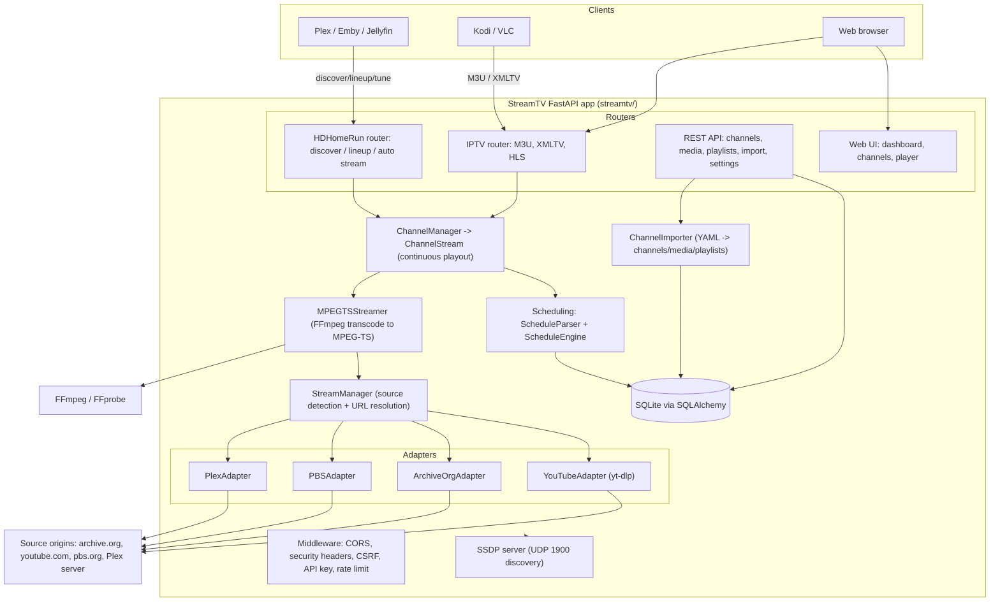
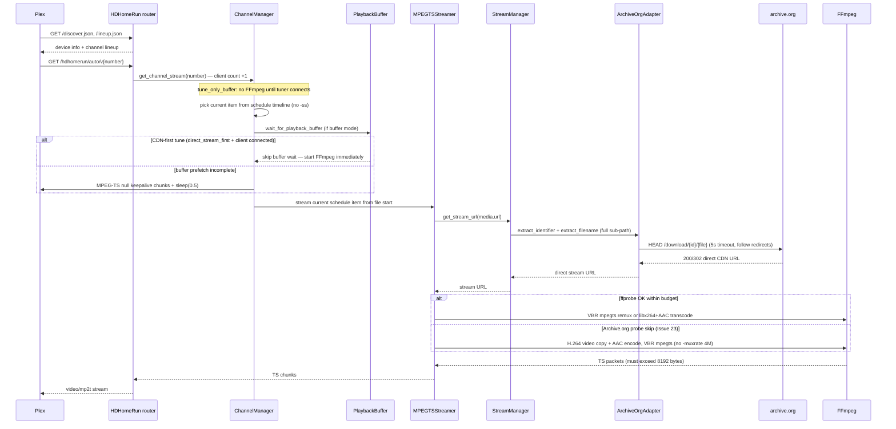
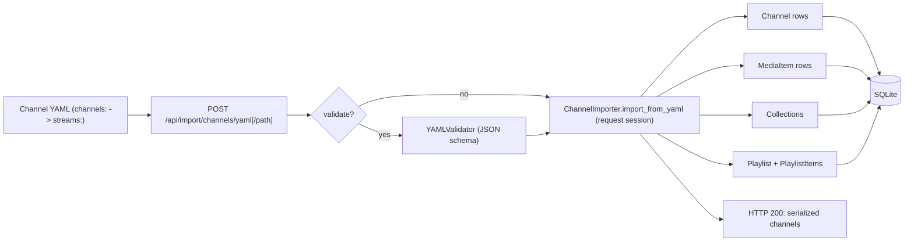
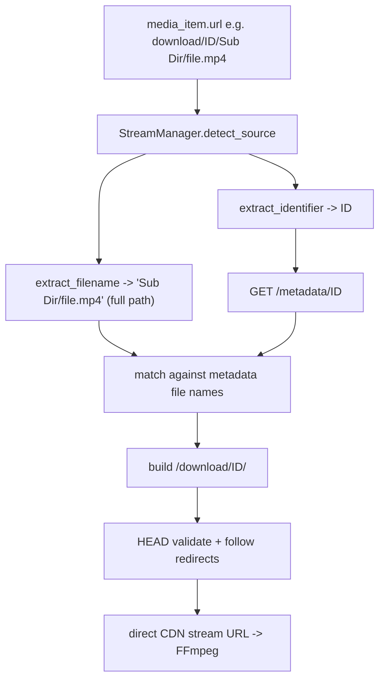
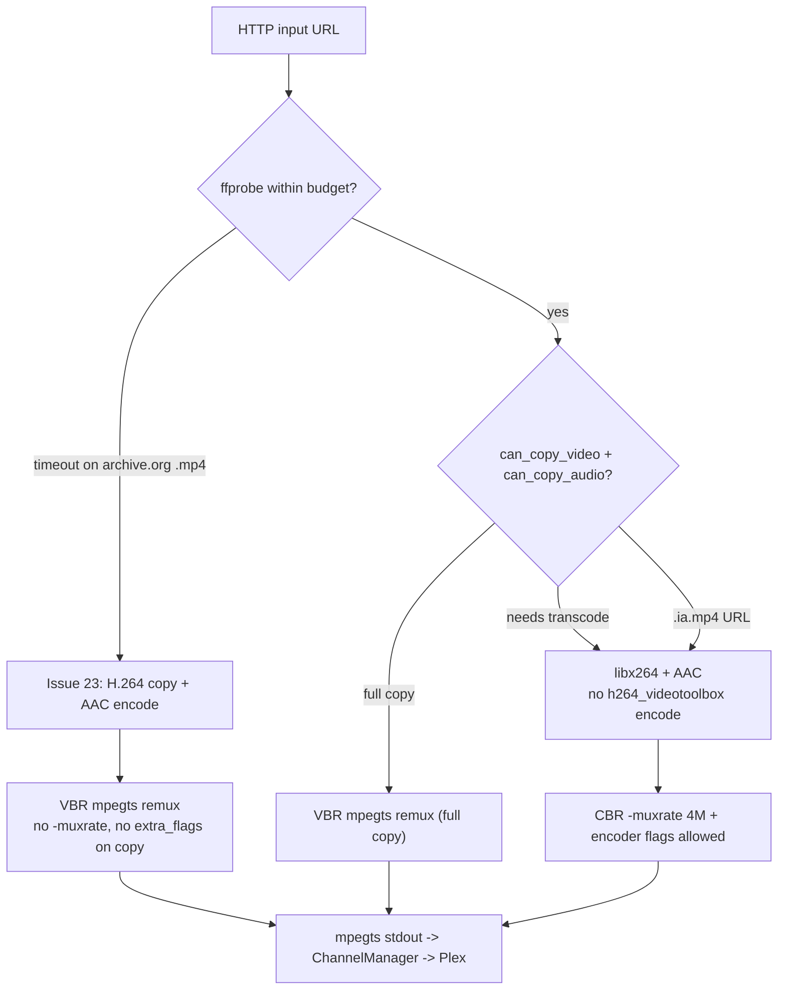
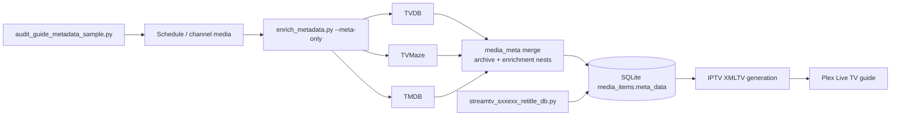
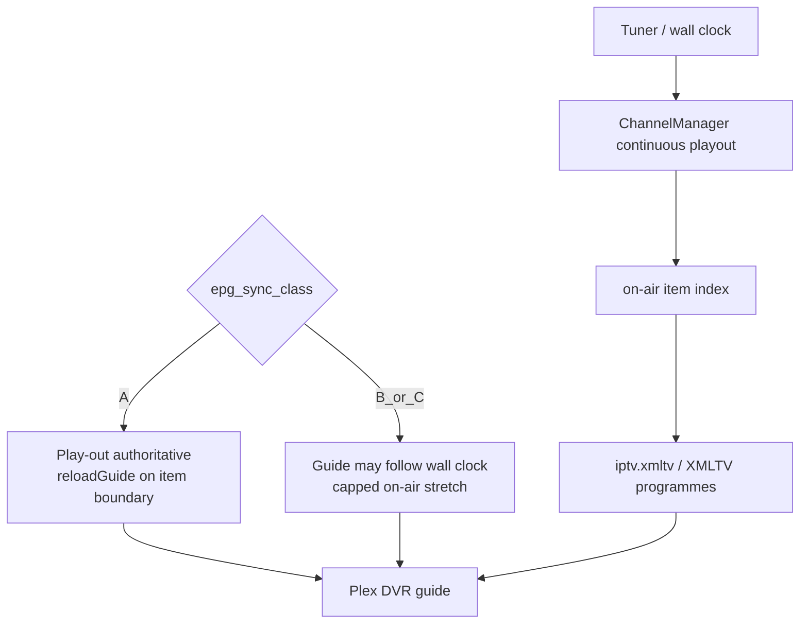

# StreamTV — Architecture

StreamTV is a cross-platform IPTV platform (FastAPI + Python) that turns online
video sources (Archive.org, YouTube, PBS, Plex) into live TV channels and exposes
them as a spoofed HDHomeRun tuner plus IPTV M3U/XMLTV for Plex, Emby, Jellyfin,
Kodi, and VLC.

> Diagrams are Mermaid. GitHub renders them automatically. Keep them in sync when
> the streaming, import, or source-resolution paths change (see
> `.cursor/rules/streaming-pipeline-verification.mdc`).

## 1. System architecture

## 2. HDHomeRun streaming (how Plex tunes a channel)

This is the platform's prime objective path. An empty stream returns HTTP 200 by
design (errors are swallowed so Plex does not hard-fail), so success is verified by
real byte count + codecs — see the `verify-hdhomerun-streaming` skill.

**Continuous playout:** `playout_start_time` + schedule durations pick **which**
item is current (EPG-aligned). Playback always starts at **0:00 of that file** —
no FFmpeg `-ss` mid-program seek. Applies to Archive.org and YouTube alike.

## 3. YAML channel import

The importer reuses the request-scoped DB session so returned ORM objects stay
attached during response serialization — see
`.cursor/rules/fastapi-orm-session-lifecycle.mdc`.

## 4. Source URL resolution (Archive.org)

The fix that unblocked Archive.org streaming: `extract_filename()` returns the full
path after the identifier (files often live in sub-directories) — see
`.cursor/rules/source-url-parsing.mdc`.

## 5. MPEG-TS remux policy (Plex path)

FFmpeg command selection in `mpegts_streamer.py`. See `.cursor/rules/ffmpeg-mpegts-plex.mdc`
and `LESSONS_LEARNED.md` Issues 23, 28–32.

## Consumer endpoints

| Consumer | Endpoint | Format |
|---|---|---|
| Plex / Emby / Jellyfin (tuner) | `/discover.json`, `/lineup.json`, `/hdhomerun/auto/v{n}` | MPEG-TS (`video/mp2t`) |
| Kodi / VLC / IPTV clients | `/iptv/channels.m3u`, `/iptv/xmltv.xml` | M3U + XMLTV EPG |
| Direct channel stream | `/iptv/channel/{n}.ts` | MPEG-TS |
| Browser preview player | `/player`, `/iptv/channel/{n}.m3u8` | HLS (needs AAC audio; see Known Issues) |

## 6. Metadata enrichment (guide quality)

Operator scripts enrich `media_items.meta_data` without changing playout
`duration`. XMLTV prefers nested `enrichment` plots/posters/`episode-num`. See
[docs/guides/METADATA_ENRICHMENT.md](docs/guides/METADATA_ENRICHMENT.md).

## 7. EPG sync classes (Plex guide vs playout)

Channels carry `epg_sync_class` **A** / **B** / **C**. Class A is
playout-authoritative (XML row 0 + boundary `reloadGuide`). See
[docs/guides/EPG_SYNC_CLASSES.md](docs/guides/EPG_SYNC_CLASSES.md).

## Distributions

The canonical application is the root `streamtv/` package. Platform mirrors
are kept in sync with `python3 scripts/build_distributions.py` when that script
is part of the release workflow.
